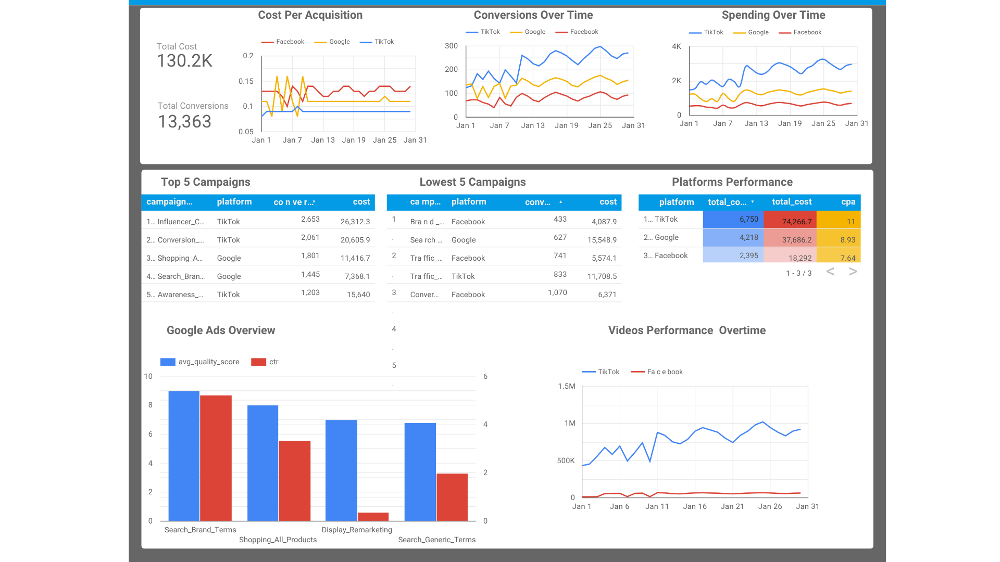

# Cross-Platform Marketing Analytics
This project analyzes campaign performance across Google Ads, Facebook Ads, and TikTok Ads using BigQuery and Looker Studio.

The objective was to standardize marketing KPIs across platforms, evaluate campaign effectiveness, and build an executive-level dashboard for performance monitoring.

## Tech Stack
- Google BigQuery
- Looker Studio
- Data Visualization
- Marketing Analytics

## Business Questions Answered
- What are the total conversions over the entire month?
- Which platform generated the highest conversions?
- Which campaigns had the best Conversions?
- Which campaigns underperformed relative to spend?
- How google ads campaign perform?
- Which platform is better for videos?

## Project Workflow
### 1. Exploratory Data Analysis (EDA)
Performed EDA on Google, Facebook, and TikTok campaign datasets to:
- Validate date ranges
- Check for null values
- Analyze schema differences
- Identify shared and platform-specific metrics

### 2. Unified Data Modeling
Created a unified BigQuery view using UNION ALL to standardize:
- Impressions
- Clicks
- Cost
- Conversions
- CTR
- CPC
- CPA

while preserving platform-specific engagement metrics.

### 3. Analytical Views
Developed reusable SQL views to answer business questions using my domain expertise:
- Platform performance
- Campaign efficiency
- Trend analysis
- Engagement analysis

### 4. Dashboard Development
Built interactive dashboards in Looker Studio to visualize the results and present them

## Key Insights
- TikTok generated the highest conversion volume, but at a higher CPA.
- Facebook demonstrated the most cost-efficient acquisition performance.
- Google campaigns (Search Brand Terms & shopping) have consistent performance in respect to CTR and quality score.
- Generally, TikTok is good for exposure and video views. Engagement metrics varied significantly across platforms, requiring platform-specific analysis.

